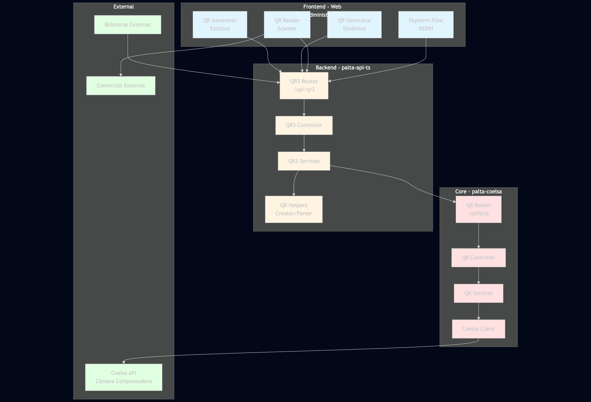
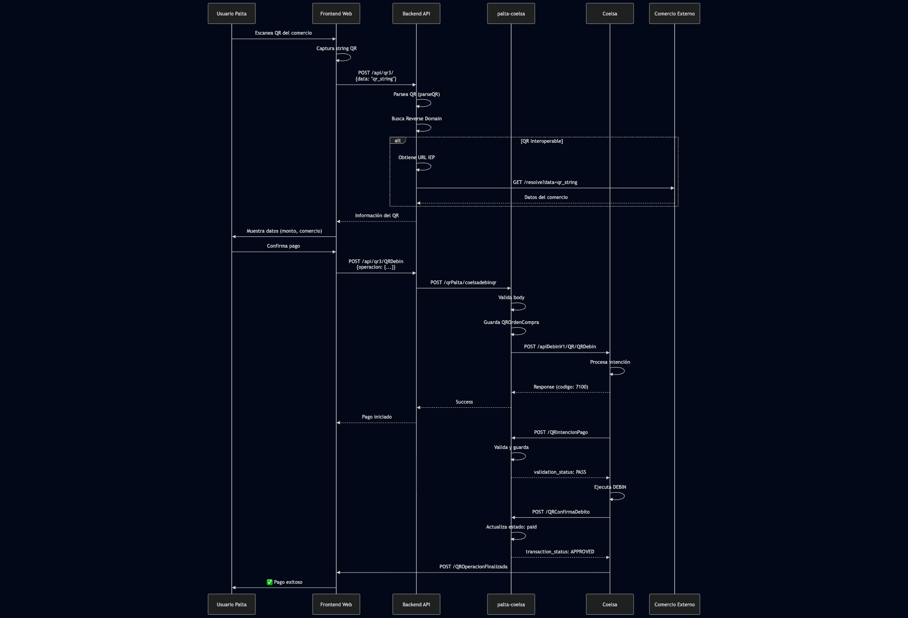
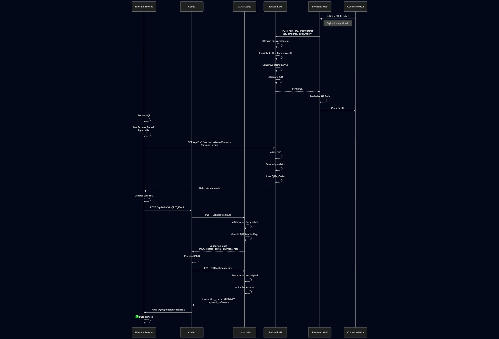

# Flujo Completo del QR Interoperable de Palta

## 📋 Índice

1. [Introducción](#introducción)
2. [Arquitectura General](#arquitectura-general)
3. [Roles de Palta](#roles-de-palta)
4. [Flujo Completo End-to-End](#flujo-completo-end-to-end)
5. [Componentes por Capa](#componentes-por-capa)
6. [Mensajería Coelsa](#mensajería-coelsa)
7. [Estructura del QR (EMVCo)](#estructura-del-qr-emvco)
8. [Casos de Uso](#casos-de-uso)
9. [Manejo de Errores](#manejo-de-errores)
10. [Referencias](#referencias)

---

## Introducción

Este documento consolida la documentación técnica completa del sistema de **QR Interoperable (Transferencias 3.0)** de Palta, integrando los flujos de:

- **Frontend** (palta-web-administrator)
- **Backend API** (palta-api-ts)
- **Core Coelsa** (palta-coelsa)

El sistema implementa el estándar de **Pagos con Transferencia (PCT)** definido por COELSA, cumpliendo con las normativas del BCRA (Comunicaciones A7153, A7462, A7463).

### Capacidades del Sistema

Palta opera en **doble rol**:

1. ✅ **Billetera/Wallet**: Usuarios de Palta pueden escanear QRs de comercios externos y pagar
2. ✅ **Aceptador/PSP**: Comercios de Palta pueden generar QRs para recibir pagos de billeteras externas

---

## Arquitectura General



### Separación de Responsabilidades

| Capa | Responsabilidad | Tecnología |
|------|----------------|------------|
| **Frontend** | UI/UX, Captura de QR, Renderizado | React, qrcode.react |
| **Backend API** | Lógica de negocio, Generación EMVCo, Validación | TypeScript, Node.js |
| **Core Coelsa** | Integración con Coelsa, Gestión de DEBIN | TypeScript, MongoDB |
| **Coelsa** | Cámara compensadora, Ejecución de transferencias | API REST |

---

## Roles de Palta

### 1. Palta como Billetera (Wallet)

**Flujo:** Usuario de Palta escanea QR de comercio externo

```
Usuario Palta → Escanea QR → Backend valida → Coelsa procesa → Pago ejecutado
```

**Componentes involucrados:**
- Frontend: `qr-reader/index.jsx`
- Backend: `POST /api/qr3/` (validación)
- Coelsa: `POST /qrPalta/coelsadebinqr` (ejecución)

### 2. Palta como Aceptador (PSP)

**Flujo:** Billetera externa escanea QR de comercio Palta

```
Billetera Externa → Escanea QR Palta → Coelsa → Backend Palta → Confirmación
```

**Componentes involucrados:**
- Frontend: `qr-generator/index.jsx`
- Backend: `POST /api/qr3/createqrtres` (generación)
- Coelsa: `POST /QRIntencionPago` (recepción desde Coelsa)

---

## Flujo Completo End-to-End

### Caso 1: Usuario Palta Paga a Comercio Externo



### Caso 2: Billetera Externa Paga a Comercio Palta



---

## Componentes por Capa

### Frontend (palta-web-administrator)

#### 1. Generación de QR Estático

**Archivo:** `src/views/qr-generator/index.jsx`

```javascript
// Flujo simplificado
const getDataQR = async (userId) => {
  const response = await axios.post('/qrtres/createqrtres', { id: userId });
  return response.data; // String QR EMVCo
};

// Renderizado
<QRCode value={qrString} size={256} />
```

**Características:**
- Monto abierto (usuario ingresa monto al pagar)
- QR permanente asociado a la cuenta
- Point of Initiation: `01` (estático)

#### 2. Generación de QR Dinámico

**Archivo:** `src/views/qr-generator-close-amount/index.jsx`

```javascript
const getDataQR = async (userId, amount, billNumber, expiringTime) => {
  const response = await axios.post('/qrtres/createqrtres', {
    id: userId,
    amount,
    billNumber,
    expiringTime
  });
  return response.data;
};
```

**Características:**
- Monto cerrado (predefinido)
- QR único por transacción
- Incluye tiempo de expiración
- Point of Initiation: `12` (dinámico)

#### 3. Escaneo de QR

**Archivo:** `src/views/qr-reader/index.jsx`

**Helper:** `src/helpers/qrHelpers/qrReader.js`

```javascript
export const getIEP = async (data, token, setError) => {
  try {
    const response = await axios.post('/qrtres', { data }, {
      headers: { Authorization: `Bearer ${token}` }
    });
    
    // Determina si es QR propio o externo
    if (response.data.resolveInStoreExternal) {
      // QR externo
      return {
        type: 'external',
        cuit: response.data.resolveInStoreExternal.cuit,
        cvu: response.data.resolveInStoreExternal.cvu,
        name: response.data.resolveInStoreExternal.name
      };
    } else {
      // QR propio de Palta
      return {
        type: 'internal',
        ...response.data
      };
    }
  } catch (error) {
    setError(error.message);
  }
};
```

#### 4. Ejecución de Pago (DEBIN)

**Archivo:** `src/views/Payments/select-wallet-by-qr3.0/SelectWalletByQR30.jsx`

**Helper:** `src/helpers/qrHelpers/qrDebin.js`

```javascript
export const postDebinQR = async (qrData, walletData) => {
  const payload = transformQRDataHelper(qrData, walletData);
  
  const response = await axios.post('/qrtres/QRDebin', {
    operacion: {
      vendedor: {
        cuit: payload.sellerCuit,
        cbu: payload.sellerCbu,
        banco: payload.bank,
        sucursal: payload.branch
      },
      comprador: {
        cuenta: {
          cbu: payload.buyerCbu,
          alias: payload.buyerAlias
        },
        cuit: payload.buyerCuit
      },
      detalle: {
        concepto: 'VAR',
        moneda: 'ARS',
        importe: payload.amount,
        qr: payload.qrString,
        qr_id_trx: payload.transactionId,
        id_billetera: payload.walletId
      }
    }
  });
  
  return response.data;
};
```

---

### Backend API (palta-api-ts)

#### Endpoints Principales

| Endpoint | Método | Descripción |
|----------|--------|-------------|
| `/api/qr3/createqrtres` | POST | Genera string QR (estático/dinámico) |
| `/api/qr3/` | POST | Valida y resuelve QR escaneado |
| `/api/qr3/instore/external/resolve` | GET | Resuelve QR de Palta para billeteras externas |
| `/api/qr3/QRDebin` | POST | Ejecuta pago DEBIN |
| `/api/qr3/getAllQRCsv/:id` | GET | Historial de QRs masivos |

#### 1. Generación de QR

**Controller:** `createQR3CommerceController`

**Service:** `createQR30CommerceService`

**Helper:** `src/helpers/qrHelpers/qr3Creator.helper.ts`

```typescript
export const createQR30Commerce = (
  commerceId: string,
  cuit: string,
  fantasyName: string,
  postalCode: string,
  amount?: number,
  billNumber?: string,
  expiringTime?: number
): string => {
  let qr = '';
  
  // 00: Payload Format Indicator
  qr += buildTag('00', '01');
  
  // 01: Point of Initiation Method
  qr += buildTag('01', amount ? '12' : '11'); // 12=dinámico, 11=estático
  
  // 26: Merchant Account Information (Expiration)
  if (expiringTime) {
    const expirationDate = new Date(Date.now() + expiringTime * 1000);
    const expirationString = formatDate(expirationDate);
    qr += buildTag('26', buildSubtag('00', expirationString));
  }
  
  // 43: Merchant Account Information (Reverse Domain + Commerce ID)
  const reverseDomain = 'app.palta';
  const encryptedCommerceId = encryptAES(commerceId);
  qr += buildTag('43', 
    buildSubtag('00', reverseDomain) + 
    buildSubtag('01', encryptedCommerceId)
  );
  
  // 50: Merchant Account Information (CUIT encriptado)
  const encryptedCuit = encryptAES(cuit);
  qr += buildTag('50', buildSubtag('00', encryptedCuit));
  
  // 52: Merchant Category Code
  qr += buildTag('52', '9700');
  
  // 53: Transaction Currency (032 = ARS)
  qr += buildTag('53', '032');
  
  // 54: Transaction Amount (solo si es dinámico)
  if (amount) {
    qr += buildTag('54', amount.toFixed(2));
  }
  
  // 58: Country Code
  qr += buildTag('58', 'AR');
  
  // 59: Merchant Name
  qr += buildTag('59', fantasyName);
  
  // 60: Merchant City (Postal Code)
  qr += buildTag('60', postalCode);
  
  // 62: Additional Data Field (Bill Number)
  if (billNumber) {
    qr += buildTag('62', buildSubtag('01', billNumber));
  }
  
  // 63: CRC
  qr += '6304'; // Placeholder
  const crc = calculateCRC16(qr);
  qr += crc;
  
  return qr;
};

// Helpers
const buildTag = (id: string, value: string): string => {
  const length = value.length.toString().padStart(2, '0');
  return `${id}${length}${value}`;
};

const buildSubtag = (id: string, value: string): string => {
  return buildTag(id, value);
};

const encryptAES = (data: string): string => {
  const cipher = crypto.createCipheriv('aes-256-ecb', 
    Buffer.from(process.env.PASSWORDHASH!), 
    null
  );
  return cipher.update(data, 'utf8', 'hex') + cipher.final('hex');
};

const calculateCRC16 = (data: string): string => {
  // CRC-16/CCITT-FALSE
  let crc = 0xFFFF;
  for (let i = 0; i < data.length; i++) {
    crc ^= data.charCodeAt(i) << 8;
    for (let j = 0; j < 8; j++) {
      crc = (crc & 0x8000) ? (crc << 1) ^ 0x1021 : crc << 1;
    }
  }
  return (crc & 0xFFFF).toString(16).toLowerCase().padStart(4, '0');
};
```

#### 2. Validación de QR Escaneado

**Controller:** `getQR3DataController`

**Service:** `getQR3DataService`

**Utils:** `src/services/utils/qr3.utils.ts`

```typescript
export const getQR3Data = async (qrString: string) => {
  // 1. Parsear QR
  const parsedQR = parseQR(qrString);
  
  // 2. Buscar Reverse Domain en tags 26-49
  let reverseDomain: string | null = null;
  for (let tag = 26; tag <= 49; tag++) {
    const tagData = parsedQR[tag.toString()];
    if (tagData && tagData['00']) {
      reverseDomain = tagData['00'];
      break;
    }
  }
  
  // 3. Si hay Reverse Domain, es QR interoperable
  if (reverseDomain) {
    // Buscar URL del IEP en BD
    const iepData = await AccessIEP.findOne({ domain: reverseDomain });
    
    if (iepData) {
      // Consultar al IEP externo
      const response = await axios.get(`${iepData.url}/resolve`, {
        params: { data: qrString }
      });
      
      return {
        type: 'interoperable',
        resolveInStoreExternal: response.data
      };
    }
  }
  
  // 4. Si no, es QR propio de Palta
  return {
    type: 'internal',
    parsedData: parsedQR
  };
};

// Parser de QR
const parseQR = (qrString: string): Record<string, any> => {
  const result: Record<string, any> = {};
  let index = 0;
  
  while (index < qrString.length) {
    const tag = qrString.substr(index, 2);
    const length = parseInt(qrString.substr(index + 2, 2));
    const value = qrString.substr(index + 4, length);
    
    // Si el valor contiene subtags, parsearlos
    if (isCompositeTag(tag)) {
      result[tag] = parseSubtags(value);
    } else {
      result[tag] = value;
    }
    
    index += 4 + length;
  }
  
  return result;
};

const parseSubtags = (data: string): Record<string, string> => {
  const subtags: Record<string, string> = {};
  let index = 0;
  
  while (index < data.length) {
    const subtag = data.substr(index, 2);
    const length = parseInt(data.substr(index + 2, 2));
    const value = data.substr(index + 4, length);
    
    subtags[subtag] = value;
    index += 4 + length;
  }
  
  return subtags;
};
```

#### 3. Resolución de QR (IEP)

**Controller:** `getQR30InvolveResolveDataController`

**Service:** `getQR30InvolveResolveDataService`

```typescript
export const resolveQR30 = async (qrString: string) => {
  // 1. Validar CRC
  const qrWithoutCRC = qrString.slice(0, -4);
  const providedCRC = qrString.slice(-4);
  const calculatedCRC = calculateCRC16(qrWithoutCRC + '6304');
  
  if (providedCRC !== calculatedCRC) {
    throw new Error('Invalid CRC');
  }
  
  // 2. Parsear QR
  const parsed = parseQR(qrString);
  
  // 3. Validar expiración (si existe)
  if (parsed['26'] && parsed['26']['00']) {
    const expirationDate = parseDate(parsed['26']['00']);
    if (new Date() > expirationDate) {
      throw new Error('QR expired');
    }
  }
  
  // 4. Desencriptar Commerce ID y CUIT
  const encryptedCommerceId = parsed['43']['01'];
  const encryptedCuit = parsed['50']['00'];
  
  const commerceId = decryptAES(encryptedCommerceId);
  const cuit = decryptAES(encryptedCuit);
  
  // 5. Buscar comercio en BD
  const commerce = await Commerce.findById(commerceId);
  
  if (!commerce) {
    throw new Error('Commerce not found');
  }
  
  // 6. Crear orden de pago
  const qrIdTrx = uuidv4();
  const payOrder = await QRPayOrder.create({
    qr_id_trx: qrIdTrx,
    commerce_id: commerceId,
    amount: parsed['54'] ? parseFloat(parsed['54']) : null,
    status: 'started',
    created_at: new Date()
  });
  
  // 7. Devolver datos para la billetera externa
  return {
    Collector: {
      cuit: commerce.cuit,
      cvu: commerce.cvu,
      name: commerce.fantasy_name
    },
    Order: {
      qr_id_trx: qrIdTrx,
      amount: parsed['54'] ? parseFloat(parsed['54']) : null,
      currency: 'ARS',
      description: parsed['62'] ? parsed['62']['01'] : null
    },
    Status: 'pending'
  };
};
```

---

### Core Coelsa (palta-coelsa)

#### Endpoints Principales

| Endpoint | Método | Rol | Descripción |
|----------|--------|-----|-------------|
| `/qrPalta/coelsadebinqr` | POST | Billetera | Genera intención de pago hacia Coelsa |
| `/QRIntencionPago` | POST | Aceptador | Recibe intención de pago desde Coelsa |
| `/QRConfirmaDebito` | POST | Aceptador | Confirma ejecución del débito |
| `/QRReverso` | POST | Aceptador | Procesa reverso de operación |
| `/QROperacionFinalizada` | POST | Ambos | Notificación de fin de operación |

#### 1. Generación de Intención de Pago (Palta como Billetera)

**Endpoint:** `POST /qrPalta/coelsadebinqr`

**Controller:** `coelsaDebinQRController`

**Service:** `coelsaDebinQRService`

```typescript
export const coelsaDebinQRService = async (bodyDebin: QRDebinCoelsaRequest) => {
  // 1. Validar estructura
  bodyDebinValidation(bodyDebin);
  
  // 2. Transformar a formato interno
  const buyOrder = transformToBuyOrder(bodyDebin);
  
  // 3. Guardar en MongoDB
  await QROrdenCompra.create({
    ...buyOrder,
    qr_id_trx: bodyDebin.operacion.detalle.qr_id_trx,
    status: 'started',
    created_at: new Date()
  });
  
  // 4. Login en Coelsa
  const config = ConfigManager.getConfiguration();
  const loginResponse = await loginDebin();
  const { access_token } = loginResponse.data;
  
  // 5. Enviar a Coelsa
  const url = `${config.coelsa.debin.API}/apiDebinV1/QR/QRDebin`;
  const response = await axios.post(url, bodyDebin, {
    headers: { Authorization: `Bearer ${access_token}` }
  });
  
  // 6. Validar respuesta
  if (response.data.respuesta.codigo === '7100') {
    return formatSuccessResponse(response.data);
  } else {
    throw new Error(response.data.respuesta.descripcion);
  }
};
```

**Tipo de Request:**

```typescript
interface QRDebinCoelsaRequest {
  operacion: {
    administrador?: { cuit: string };
    vendedor: {
      cuit: string;
      cbu: string;
      banco: string;
      sucursal: string;
      terminal?: string;
    };
    comprador: {
      cuenta: { cbu?: string; alias?: string };
      cuit: string;
    };
    detalle: {
      concepto: string;
      moneda: string;
      importe: number;
      tiempo_expiracion: number;
      descripcion?: string;
      qr: string;
      qr_hash?: string;
      qr_id_trx: string;
      id_billetera: number;
    };
    datos_generador?: {
      ubicacion?: string;
      ip?: string;
      dispositivo?: string;
    };
  };
}
```

#### 2. Recepción de Intención de Pago (Palta como Aceptador)

**Endpoint:** `POST /QRIntencionPago`

**Controller:** `QRIntencionPagoController`

**Service:** `QRIntencionPagoService`

```typescript
export const QRIntencionPagoService = async (body: QRIntencionPagoRequest) => {
  // 1. Validar vendedor (comercio de Palta)
  const seller = await validateSeller(body.operacion.vendedor.cuit);
  
  if (!seller) {
    return makeFailResponse('0110', 'Vendedor no encontrado');
  }
  
  // 2. Validar rubro/MCC
  const categoryValidation = await validateCategory(seller.category);
  
  if (!categoryValidation.valid) {
    return makeFailResponse('0120', 'Categoría de comercio no válida');
  }
  
  // 3. Guardar intención de pago
  const intencionPago = await QRIntencionPago.create({
    qr_id_trx: body.operacion.detalle.qr_id_trx,
    id_debin: body.operacion.detalle.id_debin,
    seller_cuit: body.operacion.vendedor.cuit,
    buyer_cuit: body.operacion.comprador.cuit,
    amount: body.operacion.detalle.importe,
    status: 'created',
    created_at: new Date()
  });
  
  // 4. Actualizar ORDEN DE PAGO (QROrdenPago)
  // NOTA: Cuando Palta es Aceptador, se usa QROrdenPago, no QROrdenCompra.
  await QROrdenPago.updateOne(
    { qr_id_trx: body.operacion.detalle.qr_id_trx },
    { status: 'pendiente', id_debin: body.operacion.detalle.id_debin }
  );
  
  // 5. Responder con validación exitosa
  return makePassResponse({
    qr_id_trx: body.operacion.detalle.qr_id_trx,
    id_debin: body.operacion.detalle.id_debin,
    id_billetera: body.operacion.detalle.id_billetera,
    fecha_negocio: body.operacion.detalle.fecha_negocio,
    validation_data: {
      MCC: categoryValidation.mcc,
      codigo_postal: seller.postal_code,
      payment_reference: intencionPago._id.toString() // ID interno como referencia
    }
  });
};

// Helper de respuesta exitosa
const makePassResponse = (data: any) => ({
  qr_id_trx: data.qr_id_trx,
  id_debin: data.id_debin,
  id_billetera: data.id_billetera,
  fecha_negocio: data.fecha_negocio,
  validation_data: {
    MCC: data.validation_data.MCC,
    codigo_postal: data.validation_data.codigo_postal,
    payment_reference: data.validation_data.payment_reference
  },
  validation_status: {
    status: 'PASS',
    on_error: null
  }
});

// Helper de respuesta fallida
const makeFailResponse = (code: string, description: string) => ({
  validation_status: {
    status: 'FAIL',
    on_error: {
      code,
      description
    }
  }
});
```

**Tipo de Request:**

```typescript
interface QRIntencionPagoRequest {
  operacion: {
    vendedor: {
      cuit: string;
      cbu: string;
      banco: string;
      sucursal: string;
      terminal: string;
    };
    comprador: {
      cuenta: { cbu: string; alias: string };
      cuit: string;
    };
    detalle: {
      id_debin: string;
      fecha_negocio: Date;
      concepto: string;
      id_usuario: number;
      id_comprobante: number;
      moneda: string;
      importe: number;
      qr: string;
      qr_hash: string;
      qr_id_trx: string;
      id_billetera: number;
    };
    interchange: Array<{
      importe_bruto: number;
      importe_neto: number;
      comision_comercio: number;
      importe_comision: number;
      comision_administrador: number;
      categoria_comercio: string;
      MCC: number;
    }>;
  };
}
```

#### 3. Confirmación de Débito

**Endpoint:** `POST /QRConfirmaDebito`

**Controller:** `QRConfirmaDebitoController`

**Service:** `QRConfirmaDebitoService`

```typescript
export const QRConfirmaDebitoService = async (body: QRConfirmaDebitoRequest) => {
  // 1. Buscar intención de pago original
  const intencionPago = await QRIntencionPago.findOne({
    qr_id_trx: body.operacion.detalle.qr_id_trx
  });
  
  if (!intencionPago) {
    return makeRejectedResponse('0210', 'Intención de pago no encontrada');
  }
  
  // 2. Buscar orden de compra
  const ordenCompra = await QROrdenCompra.findOne({
    qr_id_trx: body.operacion.detalle.qr_id_trx
  });
  
  // 3. Actualizar estados
  await QRIntencionPago.updateOne(
    { _id: intencionPago._id },
    { status: 'accepted', updated_at: new Date() }
  );
  
  // Actualiza la Orden de Compra (si existe, caso Wallet) o Orden de Pago (caso Aceptador)
  // El código valida ambas posibilidades dependiendo del flujo origen
  if (ordenCompra) {
    await QROrdenCompra.updateOne(
      { _id: ordenCompra._id },
      { status: 'paid', updated_at: new Date() }
    );
  }
  
  // 4. Responder con aprobación
  return makeAcceptedResponseConfirmaDebito({
    qr_id_trx: body.operacion.detalle.qr_id_trx,
    id_debin: body.operacion.detalle.id_debin,
    id_billetera: body.operacion.detalle.id_billetera,
    fecha_negocio: body.operacion.detalle.fecha_negocio,
    payment_reference: intencionPago.payment_reference || intencionPago._id.toString()
  });
};

// Helper de respuesta aprobada
const makeAcceptedResponseConfirmaDebito = (data: any) => ({
  qr_id_trx: data.qr_id_trx,
  id_debin: data.id_debin,
  id_billetera: data.id_billetera,
  fecha_negocio: data.fecha_negocio,
  payment_reference: data.payment_reference,
  transaction_status: {
    status: 'APPROVED',
    on_error: null
  }
});

// Helper de respuesta rechazada
const makeRejectedResponse = (code: string, description: string) => ({
  transaction_status: {
    status: 'REJECTED',
    on_error: {
      code,
      description
    }
  }
});
```

#### 4. Reverso de Operación

**Endpoint:** `POST /QRReverso`

**Controller:** `QRReversoController`

**Service:** `QRReversoService`

```typescript
export const QRReversoService = async (body: QRReversoRequest) => {
  // 1. Guardar registro de reverso
  await QRReverso.create({
    qr_id_trx: body.operacion.detalle.qr_id_trx,
    id_debin: body.operacion.detalle.id_debin,
    reason: body.operacion.respuesta?.descripcion || 'Reverso técnico',
    created_at: new Date()
  });
  
  // 2. Actualizar intención de pago
  await QRIntencionPago.updateOne(
    { qr_id_trx: body.operacion.detalle.qr_id_trx },
    { status: 'rejected', updated_at: new Date() }
  );
  
  // 3. Actualizar orden de compra
  await QROrdenCompra.updateOne(
    { qr_id_trx: body.operacion.detalle.qr_id_trx },
    { status: 'rejected', updated_at: new Date() }
  );
  
  // 4. Responder confirmación
  return {
    qr_id_trx: body.operacion.detalle.qr_id_trx,
    status: 'reversed'
  };
};
```

---

## Mensajería Coelsa

### Tiempos de Respuesta

| Mensaje | Timeout | Tipo |
|---------|---------|------|
| QRIntencionPago | 3 segundos | Sincrónico |
| QRConfirmaDebito | 3 segundos | Sincrónico |
| QRReverso | - | Asincrónico |
| QROperacionFinalizada | - | Asincrónico |

### Flujo Normal (Happy Path)

```
1. Billetera → Coelsa: POST /apiDebinV1/QR/QRDebin
2. Coelsa → Aceptador: POST /QRIntencionPago (< 3s)
3. Aceptador → Coelsa: Response {validation_status: PASS}
4. Coelsa → Banco Débito: POST /AvisoDebinPendiente
5. Banco Débito → Coelsa: POST /Debin/ConfirmaDebito
6. Coelsa: Control de Garantías Débito
7. Coelsa → Banco Crédito: POST /Credito
8. Coelsa → Aceptador: POST /QRConfirmaDebito (< 3s)
9. Aceptador → Coelsa: Response {transaction_status: APPROVED}
10. Coelsa: Cambia estado a "ACREDITADO"
11. Coelsa → Billetera: POST /QROperacionFinalizada
```

### Flujo de Error: Timeout en Intención de Pago

```
1. Billetera → Coelsa: POST /apiDebinV1/QR/QRDebin
2. Coelsa → Aceptador: POST /QRIntencionPago
3. Aceptador: No responde en 3 segundos (TIMEOUT)
4. Coelsa → Aceptador: POST /QRReverso
5. Coelsa → Billetera: Response error (operación reversada)
```

### Flujo de Error: Rechazo en Intención de Pago

```
1. Billetera → Coelsa: POST /apiDebinV1/QR/QRDebin
2. Coelsa → Aceptador: POST /QRIntencionPago
3. Aceptador → Coelsa: Response {validation_status: FAIL}
4. Coelsa → Billetera: Response error (operación rechazada)
```

### Flujo de Error: Rechazo en Confirma Débito

```
1-7. [Flujo normal hasta Confirma Débito]
8. Coelsa → Aceptador: POST /QRConfirmaDebito
9. Aceptador → Coelsa: Response {transaction_status: REJECTED}
10. Coelsa → Banco Crédito: POST /AvisoOperacionFinalizada (reverso)
11. Coelsa → Aceptador: POST /QRReverso
12. Coelsa → Banco Débito: POST /AvisoOperacionFinalizada (reverso)
13. Coelsa → Billetera: POST /QROperacionFinalizada (reversado)
```

---

## Estructura del QR (EMVCo)

### Formato TLV (Tag-Length-Value)

```
[ID de 2 dígitos][Longitud de 2 dígitos][Valor de N caracteres]
```

### Ejemplo Real

```
00020101021143810009app.palta016446d7180b8e4f85fa9dd6a2505f93093d8c1fd8f5891b78c95a0baf095ecc43d850360032bbc5138c322db43ba8ad6848f00d55e35204970053030325802AR5909El Golazo6005M55006304dde7b
```

### Decodificación

| Tag | Longitud | Valor | Descripción |
|-----|----------|-------|-------------|
| `00` | `02` | `01` | Payload Format Indicator (versión 01) |
| `01` | `01` | `01` | Point of Initiation (01=estático, 12=dinámico) |
| `43` | `81` | `0009app.palta01644...` | Merchant Account Info (Reverse Domain + Commerce ID) |
| `50` | `36` | `0032bbc5138c...` | Merchant Account Info (CUIT encriptado) |
| `52` | `04` | `9700` | Merchant Category Code |
| `53` | `03` | `032` | Transaction Currency (032=ARS) |
| `58` | `02` | `AR` | Country Code |
| `59` | `09` | `El Golazo` | Merchant Name |
| `60` | `05` | `M5500` | Merchant City/Postal Code |
| `63` | `04` | `dde7b` | CRC-16 Checksum |

### Tags Principales

#### Tags de Nivel Superior

| Tag | Nombre | Obligatorio | Descripción |
|-----|--------|-------------|-------------|
| `00` | Payload Format Indicator | ✅ | Versión del formato (siempre `01`) |
| `01` | Point of Initiation | ✅ | `01`=estático, `12`=dinámico |
| `26-51` | Merchant Account Information | ✅ | Datos del comercio/PSP (pueden ser múltiples) |
| `52` | Merchant Category Code | ✅ | Código MCC (ej: `9700`) |
| `53` | Transaction Currency | ✅ | Código ISO 4217 (`032`=ARS) |
| `54` | Transaction Amount | ⚠️ | Monto (solo en QR dinámicos) |
| `58` | Country Code | ✅ | Código ISO 3166-1 (`AR`) |
| `59` | Merchant Name | ✅ | Nombre del comercio |
| `60` | Merchant City | ✅ | Ciudad o código postal |
| `62` | Additional Data Field | ⚠️ | Datos adicionales (ej: Bill Number) |
| `63` | CRC | ✅ | Checksum CRC-16 |

#### Subtags del Tag 43 (Merchant Account Information)

| Subtag | Nombre | Valor en Palta |
|--------|--------|----------------|
| `00` | Globally Unique Identifier | `app.palta` (Reverse Domain) |
| `01` | Payment Network Specific | Commerce ID encriptado (AES-256) |

#### Subtags del Tag 50 (Merchant Account Information)

| Subtag | Nombre | Valor en Palta |
|--------|--------|----------------|
| `00` | Payment Network Specific | CUIT encriptado (AES-256) |

#### Subtags del Tag 26 (Merchant Account Information - Expiration)

| Subtag | Nombre | Valor en Palta |
|--------|--------|----------------|
| `00` | Expiration Date | Fecha de expiración (formato: `YYYYMMDDHHmmss`) |

#### Subtags del Tag 62 (Additional Data Field)

| Subtag | Nombre | Descripción |
|--------|--------|-------------|
| `01` | Bill Number | Número de factura/referencia |

### Encriptación

**Algoritmo:** AES-256-ECB

**Campos encriptados:**
- Commerce ID (Tag 43, Subtag 01)
- CUIT (Tag 50, Subtag 00)

**Variables de entorno:**
- `PASSWORDHASH`: Clave de encriptación (256 bits)
- `IVVAR`: Vector de inicialización (no usado en modo ECB)

```typescript
const encryptAES = (data: string): string => {
  const cipher = crypto.createCipheriv(
    'aes-256-ecb',
    Buffer.from(process.env.PASSWORDHASH!),
    null
  );
  return cipher.update(data, 'utf8', 'hex') + cipher.final('hex');
};

const decryptAES = (encrypted: string): string => {
  const decipher = crypto.createDecipheriv(
    'aes-256-ecb',
    Buffer.from(process.env.PASSWORDHASH!),
    null
  );
  return decipher.update(encrypted, 'hex', 'utf8') + decipher.final('utf8');
};
```

### CRC-16

**Algoritmo:** CRC-16/CCITT-FALSE

**Parámetros:**
- Polinomio: `0x1021`
- Valor inicial: `0xFFFF`
- XOR final: `0x0000`

```typescript
const calculateCRC16 = (data: string): string => {
  let crc = 0xFFFF;
  
  for (let i = 0; i < data.length; i++) {
    crc ^= data.charCodeAt(i) << 8;
    
    for (let j = 0; j < 8; j++) {
      if (crc & 0x8000) {
        crc = (crc << 1) ^ 0x1021;
      } else {
        crc = crc << 1;
      }
    }
  }
  
  return (crc & 0xFFFF).toString(16).toLowerCase().padStart(4, '0');
};
```

**Validación:**

```typescript
const validateCRC = (qrString: string): boolean => {
  const qrWithoutCRC = qrString.slice(0, -4);
  const providedCRC = qrString.slice(-4);
  const calculatedCRC = calculateCRC16(qrWithoutCRC + '6304');
  
  return providedCRC === calculatedCRC;
};
```

---

## Casos de Uso

### Caso 1: Comercio Palta Genera QR Estático

**Actores:**
- Comercio de Palta (Aceptador)
- Billetera Externa

**Flujo:**

1. Comercio accede a la web de administración
2. Navega a "Generar QR" → "QR Estático"
3. Frontend llama: `POST /api/qr3/createqrtres` con `{ id: userId }`
4. Backend genera string QR:
   - Point of Initiation: `11` (estático)
   - Sin monto (Tag 54 ausente)
   - Reverse Domain: `app.palta`
   - Commerce ID y CUIT encriptados
5. Frontend renderiza QR Code
6. Comercio imprime/muestra QR
7. Cliente con billetera externa escanea QR
8. Billetera lee `app.palta` y consulta: `GET /api/qr3/instore/external/resolve`
9. Backend desencripta datos y devuelve información del comercio
10. Cliente ingresa monto y confirma
11. Billetera envía pago a Coelsa
12. Coelsa notifica a Palta: `POST /QRIntencionPago`
13. Palta valida y responde: `validation_status: PASS`
14. Coelsa ejecuta DEBIN
15. Coelsa confirma: `POST /QRConfirmaDebito`
16. Palta actualiza estado y responde: `transaction_status: APPROVED`
17. ✅ Pago completado

### Caso 2: Comercio Palta Genera QR Dinámico

**Actores:**
- Comercio de Palta (Aceptador)
- Billetera Externa

**Flujo:**

1. Comercio accede a "Generar QR" → "QR Dinámico"
2. Ingresa:
   - Monto: `$1500.00`
   - N° de Factura: `FAC-001234`
   - Tiempo de Expiración: `300` segundos (5 minutos)
3. Frontend llama: `POST /api/qr3/createqrtres` con datos
4. Backend genera string QR:
   - Point of Initiation: `12` (dinámico)
   - Tag 54: `1500.00` (monto)
   - Tag 26, Subtag 00: Fecha de expiración
   - Tag 62, Subtag 01: `FAC-001234`
5. Frontend muestra QR + temporizador de expiración
6. Cliente escanea antes de expirar
7. Billetera muestra monto fijo: `$1500.00`
8. Cliente confirma (sin ingresar monto)
9. [Resto del flujo igual al Caso 1]

### Caso 3: Usuario Palta Paga a Comercio Externo

**Actores:**
- Usuario de Palta (Billetera)
- Comercio Externo (Aceptador)

**Flujo:**

1. Usuario accede a "Escanear QR"
2. Apunta cámara al QR del comercio externo
3. Frontend captura string QR
4. Frontend llama: `POST /api/qr3/` con `{ data: qrString }`
5. Backend parsea QR y detecta Reverse Domain externo (ej: `app.otrawallet`)
6. Backend busca URL del IEP en BD
7. Backend consulta: `GET https://otrawallet.com/resolve?data=...`
8. IEP externo devuelve datos del comercio
9. Backend devuelve a frontend: `{ type: 'external', resolveInStoreExternal: {...} }`
10. Frontend muestra:
    - Nombre del comercio
    - CUIT
    - Monto (si es dinámico) o campo para ingresar monto
11. Usuario selecciona cuenta de origen
12. Usuario confirma pago
13. Frontend llama: `POST /api/qr3/QRDebin`
14. Backend reenvía a: `POST /qrPalta/coelsadebinqr`
15. palta-coelsa:
    - Valida datos
    - Guarda `QROrdenCompra` (status: `started`)
    - Login en Coelsa
    - Envía: `POST /apiDebinV1/QR/QRDebin`
16. Coelsa procesa y responde: `codigo: 7100`
17. Coelsa notifica al comercio externo (fuera del alcance de Palta)
18. Coelsa ejecuta DEBIN
19. Coelsa notifica a Palta: `POST /QROperacionFinalizada`
20. palta-coelsa actualiza `QROrdenCompra` (status: `paid`)
21. Frontend muestra: ✅ "Pago exitoso"

### Caso 4: Carga Masiva de QRs (Municipios/Impuestos)

**Actores:**
- Administrador de Palta
- Sistema de Facturación Municipal

**Flujo:**

1. Administrador accede a "Carga Masiva de QRs"
2. Sube archivo CSV con:
   - CUIT del comercio
   - Monto
   - N° de Factura
   - Descripción
3. Frontend llama: `POST /api/qr3/massiveQR` con archivo
4. Backend procesa cada línea:
   - Genera QR dinámico
   - Guarda en BD con referencia al archivo
5. Backend devuelve archivo CSV con columna adicional: `qr_string`
6. Administrador descarga CSV resultante
7. Sistema de Facturación importa CSV
8. Cada factura tiene su QR único asociado
9. Ciudadanos pagan escaneando QR en sus facturas

---

## Manejo de Errores

### Errores en Intención de Pago

| Código | Descripción | Acción |
|--------|-------------|--------|
| `0110` | Vendedor no encontrado | Coelsa reversa automáticamente |
| `0120` | Categoría de comercio no válida | Coelsa reversa automáticamente |
| `0130` | CUIT inválido | Coelsa reversa automáticamente |
| `TIMEOUT` | Aceptador no responde en 3s | Coelsa envía `POST /QRReverso` |

**Respuesta de error:**

```json
{
  "validation_status": {
    "status": "FAIL",
    "on_error": {
      "code": "0110",
      "description": "Vendedor no encontrado en la base de datos"
    }
  }
}
```

### Errores en Confirma Débito

| Código | Descripción | Acción |
|--------|-------------|--------|
| `0210` | Intención de pago no encontrada | Reverso completo |
| `0220` | Orden de compra no encontrada | Reverso completo |
| `TIMEOUT` | Aceptador no responde en 3s | Reverso completo |
| `REJECTED` | Aceptador rechaza explícitamente | Reverso completo |

**Respuesta de error:**

```json
{
  "transaction_status": {
    "status": "REJECTED",
    "on_error": {
      "code": "0210",
      "description": "No se encontró la intención de pago original"
    }
  }
}
```

### Errores en Generación de QR

| Error | Causa | Solución |
|-------|-------|----------|
| Commerce not found | ID de comercio inválido | Verificar que el comercio existe en BD |
| Invalid CUIT format | CUIT con formato incorrecto | Validar formato: 11 dígitos numéricos |
| Encryption failed | Error en encriptación AES | Verificar variables de entorno `PASSWORDHASH` |
| CRC calculation failed | Error en cálculo de CRC | Revisar implementación de CRC-16 |

### Errores en Validación de QR

| Error | Causa | Solución |
|-------|-------|----------|
| Invalid CRC | QR corrupto o modificado | Rechazar QR, solicitar nuevo escaneo |
| QR expired | Fecha de expiración pasada | Solicitar nuevo QR al comercio |
| Decryption failed | Clave incorrecta o datos corruptos | Verificar `PASSWORDHASH` coincide |
| Invalid format | QR no sigue estándar EMVCo | Rechazar QR |

### Flujo de Reverso Completo

Cuando ocurre un error después de la Intención de Pago:

```
1. Coelsa → Banco Crédito: POST /AvisoOperacionFinalizada (reverso)
2. Coelsa → Aceptador: POST /QRReverso
3. Coelsa → Banco Débito: POST /AvisoOperacionFinalizada (reverso)
4. Coelsa → Billetera: POST /QROperacionFinalizada (status: reversed)
```

**Palta procesa el reverso:**

```typescript
// En QRReversoService
await QRIntencionPago.updateOne(
  { qr_id_trx },
  { status: 'rejected' }
);

await QROrdenCompra.updateOne(
  { qr_id_trx },
  { status: 'rejected' }
);
```

---

## Referencias

### Documentos Fuente

- [Frontend: QR Interoperable Documentation](./frontend_qr_documentation.md)
- [Backend: QR Interoperable Flow](./backend_qr_flow.md)
- [Coelsa: Documentación Coelsa](./coelsa_documentacion_oficial.md)
- [Coelsa: Flujo Generación Intención de Pago](./coelsa_flujo_generacion_intencion.md)
- [Coelsa: Generación y Codificación QR](./coelsa_generacion_codificacion_qr.md)
- [Coelsa: Reporte Coelsa](./coelsa_reporte_analisis.md)

### Normativas BCRA

- **Comunicación A7153**: Transferencias 3.0 - Interoperabilidad
- **Comunicación A7462**: Pagos con Transferencia (PCT)
- **Comunicación A7463**: Códigos QR Interoperables

### Estándares Técnicos

- **EMVCo QR Code Specification**: [https://www.emvco.com/emv-technologies/qrcodes/](https://www.emvco.com/emv-technologies/qrcodes/)
- **ISO 4217**: Códigos de moneda (032 = Peso Argentino)
- **ISO 3166-1**: Códigos de país (AR = Argentina)
- **CRC-16/CCITT-FALSE**: Algoritmo de checksum

### Repositorios

- **Frontend**: `palta-web-administrator-fix-adapt-qr-reader-to-qr3`
- **Backend API**: `palta-api-ts-master`
- **Core Coelsa**: `palta-coelsa-master`

### Endpoints de Producción

| Servicio | URL Base |
|----------|----------|
| Palta API | `https://api.palta.app` |
| Palta Coelsa | `https://coelsa.palta.app` |
| Coelsa Producción | `https://api.coelsa.com.ar` |
| Coelsa Testing | `https://api-test.coelsa.com.ar` |

### Variables de Entorno Clave

```bash
# Backend API (palta-api-ts)
PASSWORDHASH=<clave-aes-256-bits>
IVVAR=<vector-inicializacion>
PALTA_COELSA_URL=https://coelsa.palta.app

# Core Coelsa (palta-coelsa)
COELSA_API_URL=https://api.coelsa.com.ar
COELSA_CUIT=<cuit-palta>
COELSA_USERNAME=<usuario>
COELSA_PASSWORD=<password>
MONGODB_URI=mongodb://...
```

### Modelos de Base de Datos

#### MongoDB (palta-coelsa)

**QROrdenCompra:**
```typescript
{
  _id: ObjectId,
  qr_id_trx: string,
  seller: { cuit, cbu, bank, branch },
  buyer: { account: { cbu, alias }, cuit },
  detail: { concept, currency, amount, expireTime, qr },
  status: 'started' | 'pendiente' | 'paid' | 'rejected',
  created_at: Date,
  updated_at: Date
}
```

**QRIntencionPago:**
```typescript
{
  _id: ObjectId,
  qr_id_trx: string,
  id_debin: string,
  seller_cuit: string,
  buyer_cuit: string,
  amount: number,
  payment_reference: string,
  status: 'created' | 'accepted' | 'rejected',
  created_at: Date,
  updated_at: Date
}
```

**QRPayOrder:**
```typescript
{
  _id: ObjectId,
  qr_id_trx: string,
  commerce_id: string,
  amount: number | null,
  currency: string,
  status: 'started' | 'paid' | 'rejected',
  created_at: Date,
  updated_at: Date
}
```

**QRReverso:**
```typescript
{
  _id: ObjectId,
  qr_id_trx: string,
  id_debin: string,
  reason: string,
  created_at: Date
}
```

### Librerías Utilizadas

**Frontend:**
- `qrcode.react`: Renderizado de QR Codes
- `axios`: Cliente HTTP
- `sweetalert2`: Modales y alertas

**Backend:**
- `crypto`: Encriptación AES
- `crc`: Cálculo de CRC-16
- `uuid`: Generación de IDs únicos
- `axios`: Cliente HTTP

**Core Coelsa:**
- `mongoose`: ODM para MongoDB
- `axios`: Cliente HTTP
- `express`: Framework web

---

## Conclusión

El sistema de QR Interoperable de Palta es una implementación completa y robusta que cumple con:

✅ **Normativas BCRA**: Comunicaciones A7153, A7462, A7463  
✅ **Estándar EMVCo**: Formato TLV, tags obligatorios, CRC-16  
✅ **Protocolo Coelsa**: Mensajería completa (Intención, Confirmación, Reverso)  
✅ **Doble Rol**: Billetera y Aceptador/PSP  
✅ **Seguridad**: Encriptación AES-256, validación CRC  
✅ **Interoperabilidad**: Compatible con billeteras y comercios externos  

El flujo está diseñado para minimizar falsos positivos, garantizar la trazabilidad mediante `payment_reference`, y cumplir con los tiempos de respuesta estrictos (3 segundos) requeridos por Coelsa.
