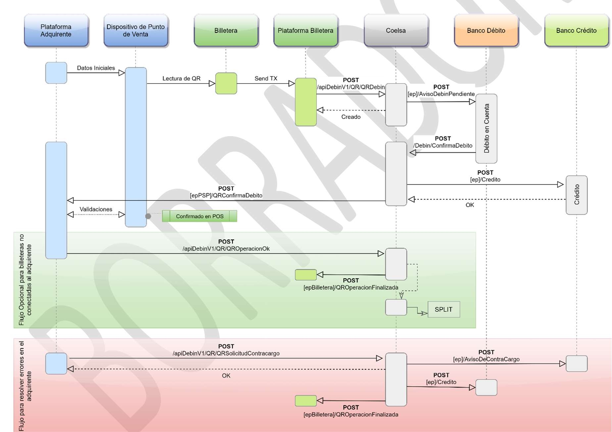
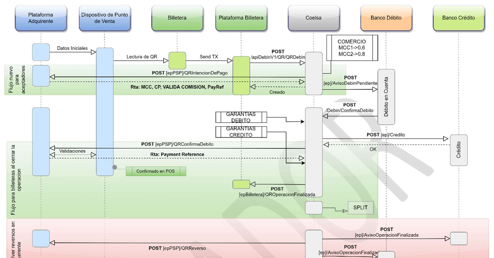
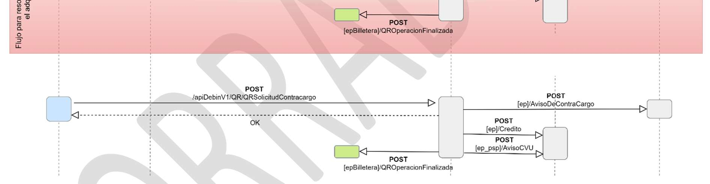
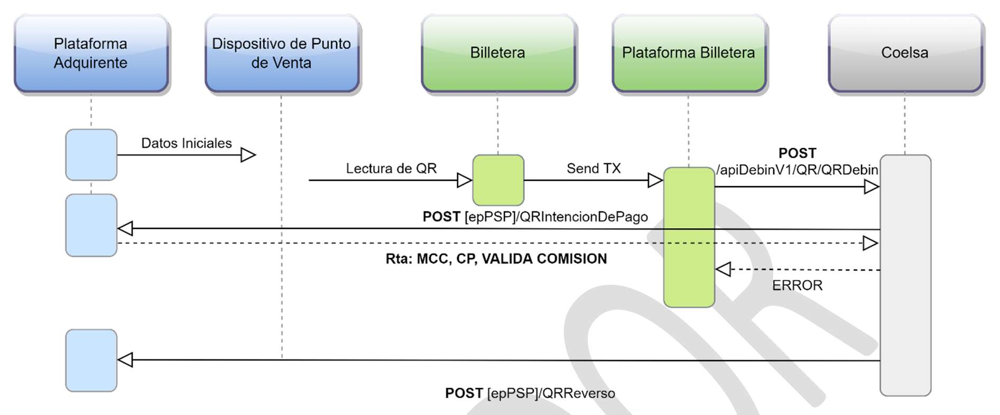
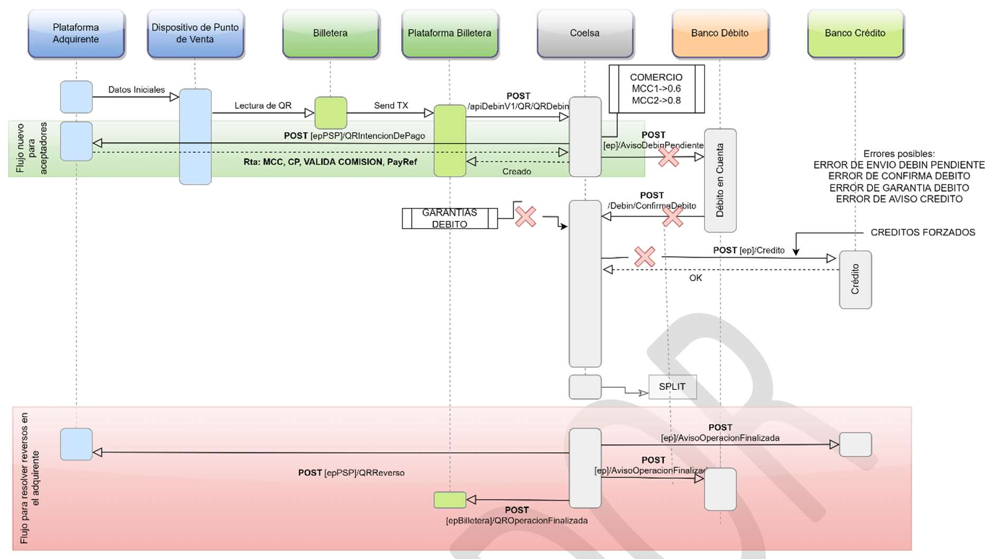
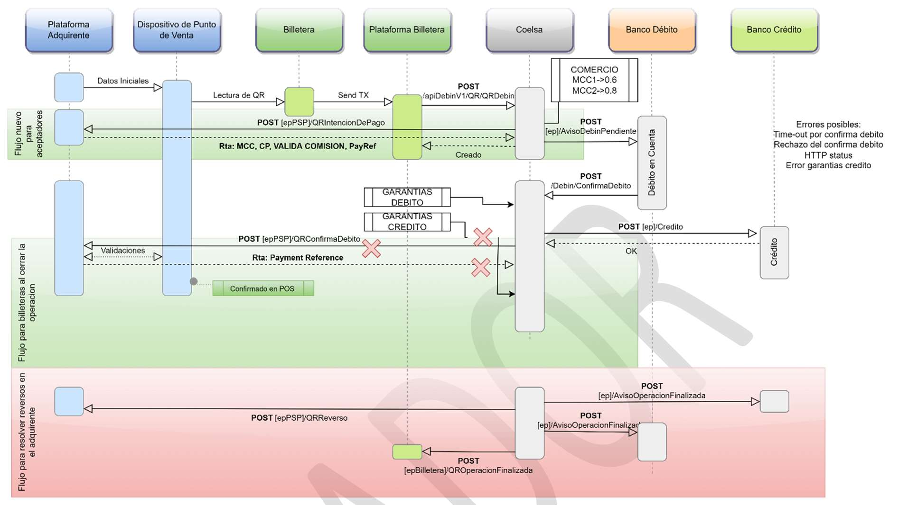

> Gerencia de Ingeniería y Datos
>
> Desarrollo
>
> FLUJO TRX3.1 PAGOS QR Medios de Pagos On Line

||
||
||

> Este documento debe ser considerado copia no controlada una vez
> impreso o fuera del repositorio documental de COELSA

> INDICE
>
> 1\.
> OBJETIVO.....................................................................................................................................................3
>
> 2\.
> ALCANCE......................................................................................................................................................3
>
> 3\. AMBITO DE
> APLICACION..........................................................................................................................3
>
> 4\. DESTINATARIOS (AREAS \| SECTORES \| ROLES
> AFECTADOS).........................................................3
>
> 5\. REFERENCIAS
> GENERALES.....................................................................................................................3
>
> 6\.
> DESARROLLO..............................................................................................................................................4
>
> Introducción........................................................................................................................4
> Comportamiento actual
> ......................................................................................................4
> Comportamiento
> esperado..................................................................................................5
>
> 7\. PROCEDIMIENTO ALTERNATIVO
> .........................................................................................................13
>
> 8\.
> GLOSARIO..................................................................................................................................................13
>
> 9\. REGISTROS Y
> ANEXOS...........................................................................................................................13

||
||
||

> Este documento debe ser considerado copia no controlada una vez
> impreso o fuera del repositorio documental de COELSA

> 1\. OBJETIVO
>
> Establecer el nuevo flujo de la operatoria de PCT (Pagos con
> Transferencia) para billeteras y aceptadores administrados por COELSA
> en base a los requerimientos normativos de TRX 3.1
>
> 2\. ALCANCE
>
> Este documento describe toda la mensajería involucrada en el proceso
> de Pago con Transferencia desde la intención de pago de la Billetera
> hasta la confirmación de este por el Aceptador.
>
> 3\. AMBITO DE APLICACION
>
> Los lineamientos del presente Documento aplican a la integración que
> deben realizar Billeteras y Aceptadores para integrarse al Sistema de
> Medios de Pago On-Line de COELSA particularmente con la funcionalidad
> PCT.
>
> 4\. DESTINATARIOS (AREAS \| SECTORES \| ROLES AFECTADOS)
>
> Este documento es dirigido a:
>
>  Billeteras
>
>  Aceptadores
>
>  Áreas Técnicas de COELSA (Desarrollo, QA, Soporte)
>
> 5\. REFERENCIAS GENERALES
>
> Para la confección de este documento se tienen en cuenta la
> Comunicación del BCRA A7153, A7462, A7463 y los acuerdos generados en
> las mesas técnicas y funcionales.

||
||
||

> Este documento debe ser considerado copia no controlada una vez
> impreso o fuera del repositorio documental de COELSA

> 6\. DESARROLLO <u>Introducción</u>
>
>  style="width:5.795in;height:4.08667in" />Se solicita generar las
> customizaciones necesarias al circuito de PagosQR para mejorar la
> experiencia de usuario de Billeteras y Aceptadores reduciendo al
> mínimo los falsos positivos en las transacciones de tipo PCT y también
> posibilitar recibir de los aceptadores y proporcionárselo a las
> billeteras el código de Payment Reference para poder tener tanto en
> las Billeteras como en los Aceptadores un único código de referencia
> de la transacción de PCT.
>
> En el diagrama a continuación se detalla el Circuito Actual de Pagos
> QR.
>
> Figura 1 Circuito Pagos QR
>
> <u>Comportamiento actual</u>
>
> El circuito actual admite el Pago QR, pero no incluye el código de
> Payment Reference, el mensaje de Confirma Debito es asincrónico y no
> contempla la mensajería de Intención de Pago.

||
||
||

> Este documento debe ser considerado copia no controlada una vez
> impreso o fuera del repositorio documental de COELSA

> <u>Comportamiento esperado</u>
>
> Mantener el funcionamiento del circuito actual, estableciendo un
> tiempo de duración de la transacción de 15 segundos según normativa
> vigente y agregando el mensaje de Intención de Pago mediante el cual
> el Aceptador validaráel Interchange que se cobrará y a su vez
> responderá el condigo MCC a utilizar en ese pago junto con el Código
> Postal del comercio en el cual se está realizando dicho pago y el
> Payment Reference si lo tuviera en esa instancia.
>
> Luego de la aceptación por parte del Aceptador del mensaje POST
> \[EPPSP\]/QRIntenciondepago el flujo continúa realizando el mensaje
> POST \[ep\]/AvisoDebinPendiente alBancoDebitoyuna vezqueel
> banconosenvía elmensaje POST /Debin/ConfirmaDebito de forma exitosa se
> realiza el control de garantía debito y el aviso POST \[ep\]/Credito
> 1al Banco Credito, luego de esto realizamos hacia el Aceptador el
> mensaje POST \[epPSP\]/QRConfirmaDebito.
>
> El mensaje de Confirma Debito al Aceptador pasará a ser sincrónico con
> lo cual COELSA mantendrá la transacción con estado “EN CURSO”, con la
> respuesta del aceptador de forma afirmativa se cambiará el estado de
> la transacción a “ACREDITADO”, en esta respuesta el aceptador
> informará el Payment Reference. Una vez que el aceptador realizo esto,
> COELSA informara a la Billetera mediante el mensaje de QROperación
> Finalizada que la transacción finalizo correctamente y los fondos
> fueronacreditadosalAceptador.
> Deestamaneraeliminaríamoslosfalsospositivos que se dan en las
> Billeteras por estar consultando el estado de la transacción en COELSA
> ya que hasta tanto el Aceptador no confirme la operación no se pasaría
> el estado de esta a ACREDITADO. Además, se podrá diferenciar una
> reversa técnica de una devolución.
>
> En el caso que el ACEPTADOR rechace la Intención de Pago COELSA le
> enviaría un mensaje de Operación Finalizada a la Billetera con el
> rechazo de esta.
>
> 1 Nota Importante: Este aviso es forzado con lo cual Se asume que
> cualquier código de respuesta distinto a 03, 04 y 06 son problemas
> temporales de la entidad para aplicar el crédito en la cuenta destino.
> De la misma forma se toma en los casos en que la entidad no responde
> en el tiempo estipulado. En estos casos, la operación queda
> compensada. No se enviarán los mensajes de reverso a ninguno de los
> dos extremos. Se espera que la entidad realice la aplicación del
> crédito en la cuenta destino.
>
> Se enviará una nueva API que expondrá la entidad, los reintentos
> correspondientes para el crédito hasta la hora del cierre del
> producto. Si la entidad aún no pudo aplicar el crédito en la cuenta,
> deberá tomar la información del archivo de conciliacion para su
> correcta aplicación.

||
||
||

> Este documento debe ser considerado copia no controlada una vez
> impreso o fuera del repositorio documental de COELSA

> En el diagrama a continuación se detalla el Circuito Propuesto Pagos
> QR.
>
>  style="width:5.92833in;height:3.09333in" /> style="width:5.92833in;height:1.545in" />Figura 2 Circuito Propuesto
> de Pagos QR
>
> Mensaje QR Intención de Pago:
>
> COELSA realizara el llamado al EP del Aceptador POST
> \[EPPSP\]/QRIntenciondepago este es un mensaje sincrónico en el cual
> se enviarán los datos de la intención de pago de la Billetera como así
> también los datos del interchange a realizar según los códigos MCC que
> COELSA tiene configurados para el comercio del Aceptador. Para la
> respuesta a este mensaje el Aceptador cuenta con un tiempo de 3
> segundos.
>
> El Aceptador responderá aceptando o no esa intención de pago en el
> campo status del objeto validation_status (“PASS” o “FAIL”) y
> respondiendo los datos del MCC a utilizar en ese pago junto con el
> código postal y el payment reference si lo tuviera disponible en esta
> instancia.

||
||
||

> Este documento debe ser considerado copia no controlada una vez
> impreso o fuera del repositorio documental de COELSA

> A continuación, veremos los flujos en caso de error
>
>  style="width:5.92833in;height:2.46667in" />Figura 3 Circuito Error
> QRIntenciondepago
>
> En este mensaje existen 3 posibilidades de error:
>
>  El Aceptador no responde dentro de los 3 segundos con lo cual la
> operación se cae por timeout, en este caso se envía al Aceptador un
> mensaje POST \[epPSP\]/QRReverso y a la Billetera se le responde con
> error el mensaje POST /apiDebinV1/QR/QRDebin indicando que se reversa
> la operación.
>
>  El Aceptador responde el mensaje con un “FAIL” en este caso a la
> Billetera se le responde el mensaje POST /apiDebinV1/QR/QRDebin
> indicando que se reversa la operación.
>
>  El Aceptador responde el mensaje con un “PASS” pero los datos de
> respuesta son rechazados en las validaciones de COELSA este caso es
> similar al timeout, se envía al Aceptador un mensaje POST
> \[epPSP\]/QRReverso y a la Billetera se le responde con error el
> mensaje POST /apiDebinV1/QR/QRDebin indicando que se reversa la
> operación.

||
||
||

> Este documento debe ser considerado copia no controlada una vez
> impreso o fuera del repositorio documental de COELSA

>  style="width:5.92833in;height:3.315in" />Figura 4 Circuito Error post
> mensaje QRIntenciondepago
>
> Luego de recibir la respuesta del mensaje QRIntenciondepago con un
> “PASS” se continua con el flujo de la operación, en este caso tenemos
> 4 posibilidades de error:
>
>  En el mensaje POST \[ep\]/AvisoDebinPendiente  En el mensaje POST
> /Debin/ConfirmaDebito
>
>  En el proceso de Garantías Debito  En el mensaje POST
> \[ep\]/Credito
>
> En cualquiera de estos casos se realizan los siguientes mensajes:
>
>  POST \[ep\]/AvisoOperacionFinalizada al Banco Crédito indicando que
> reverse la operación.
>
>  POST \[epPSP\]/QRReverso al Aceptador indicando que reverse la
> operación.
>
>  POST \[ep\]/AvisoOperacionFinalizada al Banco Debito indicando que
> reverse la operación.
>
>  POST \[epBilletera\]/QROperacionFinalizada a la Billetera indicando
> que reverse la operación.

||
||
||

> Este documento debe ser considerado copia no controlada una vez
> impreso o fuera del repositorio documental de COELSA

> POST \[EPPSP\]/QRIntenciondepago
>
> Request {
>
> "operacion": { "vendedor": {
>
> "cuit": "string", "cbu": "string", "banco": "string", "sucursal":
> "string", "terminal": "string"
>
> }, "comprador": {
>
> "cuenta": { "cbu": "string", "alias": "string"
>
> },
>
> "cuit": "string" },
>
> "detalle": { "id_debin": "string",
>
> "fecha_negocio": "2022-05-23T12:10:08.628Z", "concepto": "string",
>
> "id_usuario": 0, "id_comprobante": 0, "moneda": "string", "importe":
> 0,
>
> "qr": "string", "qr_hash": "string", "qr_id_trx": "string",
> "id_billetera": 0
>
> }, "interchange": \[
>
> {
>
> "importe_bruto": 0, "importe_neto": 0, "comision_comercio": 0,
> "importe_comision": 0, "comision_administrador": 0,
> "categoria_comercio": "string", “MCC”:0
>
> } \]
>
> } }

||
||
||

> Este documento debe ser considerado copia no controlada una vez
> impreso o fuera del repositorio documental de COELSA

> Responses {
>
> "qr_id_trx": "string", "id_debin": "string", "id_billetera": 0,
>
> "fecha_negocio": "2022-05-23T12:10:08.628Z", “validation_data”: {
>
> “MCC”:0, “codigo_postal”: ”string”,
>
> “payment_reference”: ”string”, },
>
> validation_status": { "status": "PASS", "on_error": {
>
> "code": "string", "description": "string"
>
> } }
>
> }
>
> Mensaje QR Confirma Debito:
>
> COELSArealizaraelllamadoalEPdelAceptadorPOST\[epPSP\]/QRConfirmaDebitoeste
> es un mensaje sincrónico en el cual se enviarán los datos de la
> operación es básicamente el mismo request del mensaje
> QRIntenciodepago, con la diferencia que el campo Interchange tiene
> solamente los datos del MCC que se informó en la Intención de Pago. Al
> igual que en el mensaje de Intencion de Pago el Aceptador cuenta con 3
> segundos para responder este mensaje.
>
> El Aceptador responderá aceptando o no el mensaje de QRConfirmadebito
> indicando en el campo status del objeto transaction_status(“APPROVED”
> o “REJECTED”) y respondiendo en el campo payment_reference, este campo
> debe ser el mismo que se informo en la respuesta de la Intención de
> Pago, este código sirve para informarlo a la Billetera en el mensaje
> POST\[epBilletera\]/QROperacionFinalizada ya que es el código para
> poder vincular la operación tanto en el Aceptador(Comercio) como en la
> Billetera(Usuario).
>
> Una vez que el Aceptador contesta el mensaje con un “APPROVED” cambia
> el estado de la operación de “EN CURSO” a “ACREDITADO” y se dispara de
> forma automática de COELSA el mensaje de Operación Finalizada a la
> Billetera.

||
||
||

> Este documento debe ser considerado copia no controlada una vez
> impreso o fuera del repositorio documental de COELSA

> A continuación, veremos los flujos en caso de error
>
> Figura
> 5 Circuito Error mensaje QRConfirmadebito
>
> En esta parte del flujo tenemos 3 posibilidades de error:
>
>  El Aceptador no responde dentro de los 3 segundos con lo cual la
> operación se cae por timeout, en este caso se reversa la operación y
> se envía al Aceptador un mensaje POST \[epPSP\]/QRReverso, al Banco
> Debito y al Banco Crédito se les
> envíaelmensajePOST\[ep\]/AvisoOperacionFinalizada ya la Billeterasele
> envía el mensaje POST \[epBilletera\]/QROperacionFinalizada
>
>  Error en el proceso de Garantías Crédito, en este caso se reversa la
> operación y se envía al Aceptador un mensaje POST \[epPSP\]/QRReverso,
> al Banco Debito y al Banco Crédito se les envía el mensaje POST
> \[ep\]/AvisoOperacionFinalizada y a la Billetera se le envía el
> mensaje POST \[epBilletera\]/QROperacionFinalizada
>
>  El Aceptador responde el mensaje con un “REJECTED”, en este caso se
> reversa la operación y se envía al Aceptador un mensaje POST
> \[epPSP\]/QRReverso, al Banco Debito y al Banco Crédito se les envía
> el mensaje POST \[ep\]/AvisoOperacionFinalizada y a la Billetera se le
> envía el mensaje POST \[epBilletera\]/QROperacionFinalizada

||
||
||

> Este documento debe ser considerado copia no controlada una vez
> impreso o fuera del repositorio documental de COELSA

> En el caso que el Aceptador por alguna razón no reciba el mensaje POST
> \[epPSP\]/QRConfirmaDebito o POST \[epPSP\]/QRReverso deberá consultar
> el DEBIN para conocer el estado de este, para esto deberá realizar el
> control de tiempo de 15 segundos de duración de la transacción a
> partir de la recepción del mensaje de Intención de Pago.
>
> POST \[epPSP\]/QRConfirmaDebito
>
> Request {
>
> "operacion": { "vendedor": {
>
> "cuit": "string", "cbu": "string", "banco": "string", "sucursal":
> "string", "terminal": "string"
>
> }, "comprador": {
>
> "cuenta": { "cbu": "string", "alias": "string"
>
> },
>
> "cuit": "string" },
>
> "detalle": { "id_debin": "string",
>
> "fecha_negocio": "2022-05-23T12:29:17.374Z", "concepto": "string",
>
> "id_usuario": 0, "id_comprobante": 0, "moneda": "string", "importe":
> 0,
>
> "qr": "string", "qr_hash": "string", "qr_id_trx": "string",
> "id_billetera": 0
>
> }, "interchange": {
>
> "importe_bruto": 0, "importe_neto": 0, "comision_comercio": 0,
> "importe_comision": 0,

||
||
||

> Este documento debe ser considerado copia no controlada una vez
> impreso o fuera del repositorio documental de COELSA

> "comision_administrador": 0, "categoria_comercio": "string", “MCC”: 0
>
> }, "respuesta": {
>
> "codigo": "string", "descripcion": "string"
>
> } }
>
> }
>
> Responses {
>
> "qr_id_trx": "string", "id_debin": "string", "id_billetera": 0,
>
> "fecha_negocio": "2022-05-23T12:10:08.628Z", “payment_reference”:
> ”string”, transaction_status": {
>
> "status": "APPROVED", "on_error": {
>
> "code": "string", "description": "string"
>
> } }
>
> }
>
> 7\. PROCEDIMIENTO ALTERNATIVO
>
> N/A.
>
> 8\. GLOSARIO
>
> N/A.
>
> 9\. REGISTROS Y ANEXOS
>
> N/A.

||
||
||

> Este documento debe ser considerado copia no controlada una vez
> impreso o fuera del repositorio documental de COELSA
